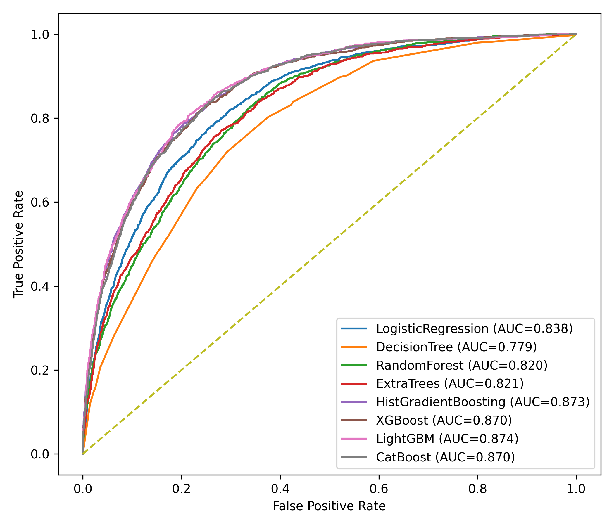
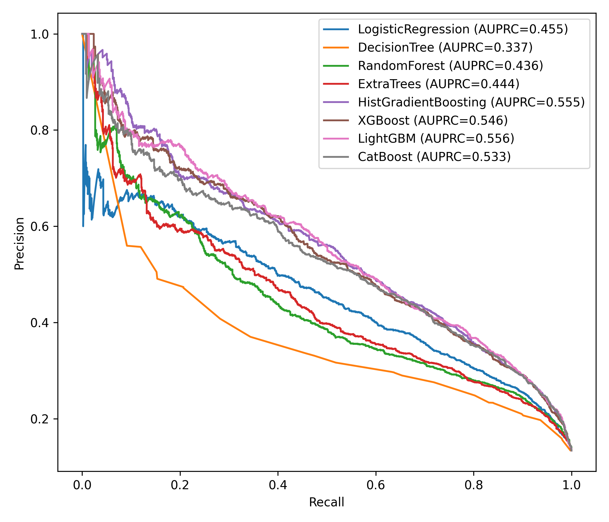
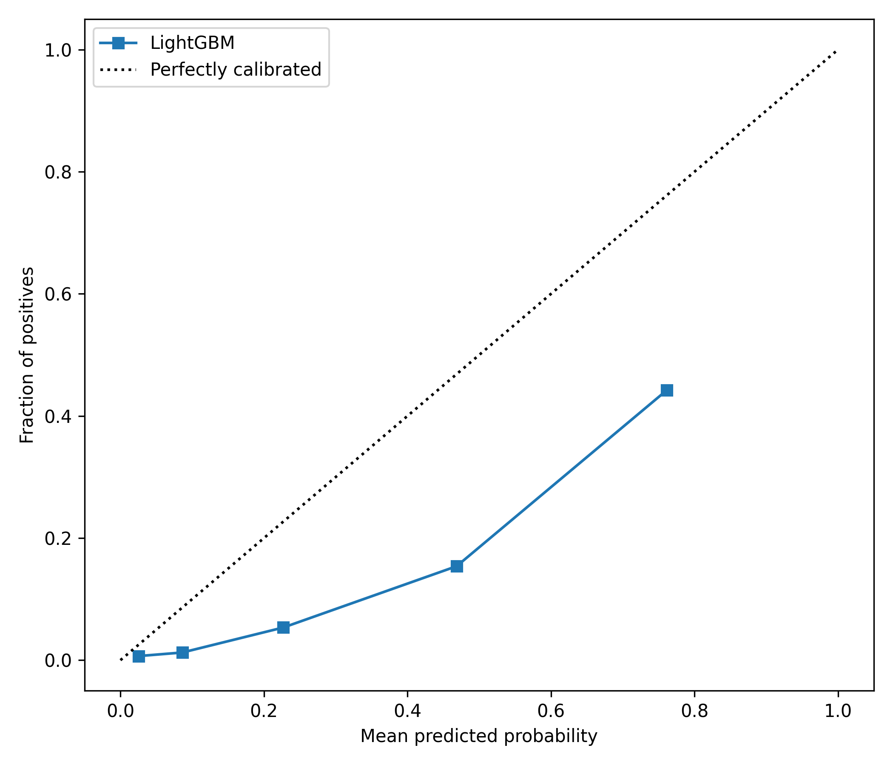
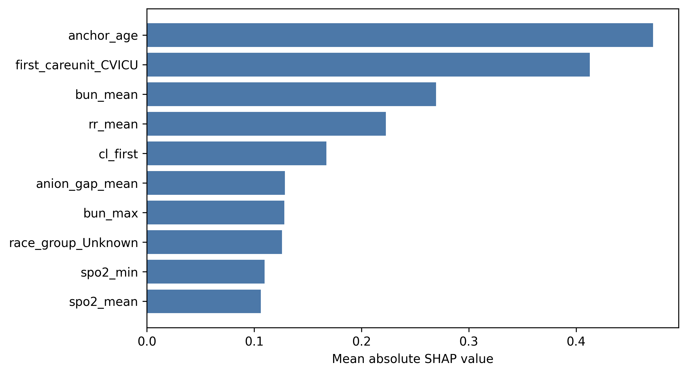
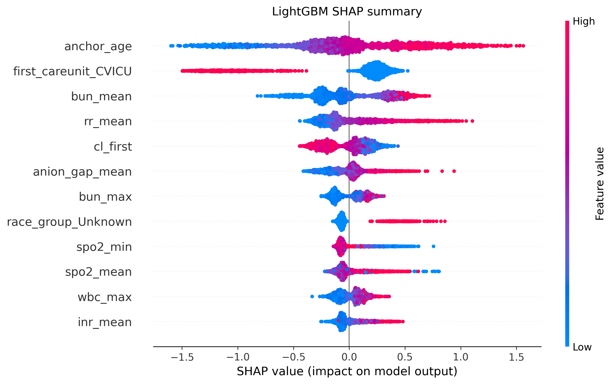

# 基于 MIMIC-IV 早期结构化数据的 ICU 患者 28 天死亡风险预测研究

Deck type: course final report / research presentation for teacher review  
Planned slide count: 16  
Generation mode: codex-ppt image-based full-slide deck  
Template reference: original PPT rendered pages under `assets/style-reference/`; use as visual reference only, not as content source.

## Style Reference From Original PPT

- Preserve: clean academic presentation style, deep blue + teal accent color, large Chinese section titles, clear title hierarchy, professional medical-data tone.
- Improve: make each experiment page explain design and method before result, reduce vague promotional language, avoid conclusion-style slide titles, use teacher-facing wording, and make the experimental logic easier to follow.
- Style reference images:
  - `assets/style-reference/template-cover.png`
  - `assets/style-reference/template-content.png`
  - `assets/style-reference/template-section.png`

## Slide 1: 封面

- Title: 基于 MIMIC-IV 早期结构化数据的 ICU 患者 28 天死亡风险预测研究
- Key points:
  - 仅保留汇报题目
- Visual idea: deep blue academic cover, centered title, subtle clinical-data grid; no metrics, no student/course/date placeholders.
- Layout role: cover.
- Required images: none.

## Slide 2: 目录

- Title: 汇报目录
- Key points:
  - 研究背景与任务定义
  - 数据队列与特征构建
  - 模型训练与评估方法
  - 改进实验：校准、缺失机制、消融、SHAP 稳定性
  - 代码结构、局限与总结
- Visual idea: five-part agenda with numbered blocks; use the original PPT's deep blue / teal section style; no subtitle and no bottom route bar.
- Layout role: agenda.
- Required images: none.

## Slide 3: 研究背景

- Title: 研究背景
- Key points:
  - ICU 早期死亡风险评估有助于病情分层、资源安排和后续治疗决策。
  - 公开 ICU 数据集和机器学习模型已经广泛用于死亡风险预测，因此本项目不能只停留在“训练一个模型”。
  - 本研究选择 MIMIC-IV 衍生数据，围绕早期结构化变量建立 28 天死亡风险预测实验。
  - 后续改进实验重点回答：模型概率是否可靠、缺失信息是否有价值、哪些特征组贡献最大、解释结果是否稳定。
- Visual idea: left text explanation + right clinical prediction workflow illustration.
- Layout role: context / problem.
- Required images: none.

## Slide 4: 预测任务与队列定义

- Title: 预测任务与队列定义
- Key points:
  - 预测目标：`death_28d`，即 ICU 入科后 28 天内是否死亡。
  - 队列筛选：ICU 住院时长可用，且 ICU 住院时长不少于 24 小时，结局标签明确。
  - 当前建模队列：51,838 条 ICU 住次，其中 6,935 例 28 天死亡，事件率 13.38%。
  - 数据划分：分层训练集/测试集划分；训练集 41,470，测试集 10,368；训练集中进行 5 折交叉验证。
- Visual idea: cohort selection funnel and train/test split panel.
- Layout role: task definition / data summary.
- Required images: none.

## Slide 5: 特征体系

- Title: 特征体系
- Key points:
  - 人口学变量：年龄、性别、种族分组。
  - ICU 入科信息：first care unit，用于反映患者入科时所在专科单元。
  - 前 24 小时生命体征：心率、呼吸频率、SpO2、收缩压、舒张压、平均动脉压、体温等。
  - 前 24 小时实验室指标：血常规、电解质、肾功能、血糖、阴离子间隙、凝血功能等。
  - 预处理方法：数值变量中位数填补与标准化，分类变量众数填补与 one-hot 编码。
- Visual idea: three to four feature-group cards with icons and preprocessing strip.
- Layout role: method / feature engineering.
- Required images: none.

## Slide 6: 实验流程

- Title: 实验流程
- Key points:
  - 数据构建：从 `ch3_analysis_dataset.parquet` 构建 ICU 28 天死亡建模数据集。
  - 模型训练：比较 Logistic Regression、Decision Tree、Random Forest、ExtraTrees、HistGradientBoosting、XGBoost、LightGBM、CatBoost。
  - 模型选择：在训练集使用交叉验证和参数网格搜索，测试集用于最终报告。
  - 评估输出：AUROC、AUPRC、Accuracy、Precision、Recall、F1、Brier score、Bootstrap 95% CI、ROC/PR/校准曲线。
  - 解释输出：模型特征重要性、SHAP 全局重要性和 SHAP summary plot。
- Visual idea: horizontal pipeline from data -> preprocessing -> model candidates -> evaluation -> interpretation.
- Layout role: workflow / experiment method.
- Required images: none.

## Slide 7: 代码结构

- Title: 代码结构
- Key points:
  - `run.py`：实验主入口，负责解析命令行参数并调用数据构建、训练和扩展实验。
  - `config.py`：定义路径、目标变量、特征列表、随机种子、交叉验证折数、bootstrap 轮数和 SHAP 抽样量。
  - `dataset.py`：完成队列筛选和建模数据集构建。
  - `model_specs.py`：集中定义候选模型和参数网格。
  - `train_eval.py` 与 `experiments.py`：分别负责基础训练评估和扩展实验模块。
- Visual idea: code module map with arrows from entry script to outputs.
- Layout role: code demo / reproducibility.
- Required images: none.

## Slide 8: 基线模型比较

- Title: 基线模型比较
- Key points:
  - 方法：对 8 类候选模型进行相同训练/测试划分和交叉验证比较。
  - 主要指标：AUROC 衡量排序能力，AUPRC 适合类别不平衡场景，F1 反映阈值后分类表现，Brier score 衡量概率误差。
  - 结果摘要：LightGBM 测试集 AUROC 0.874，AUPRC 0.556，F1 0.538。
  - 对比观察：HistGradientBoosting 与 XGBoost 的 AUROC 接近，同时 Brier score 更低，提示后续需要单独分析概率校准。
- Visual idea: model performance table with four metrics and a short interpretation box.
- Layout role: baseline result / comparison.
- Required images: none.

## Slide 9: 评估指标与曲线

- Title: 评估指标与曲线
- Key points:
  - ROC 曲线用于比较不同阈值下的敏感性和特异性折中。
  - PR 曲线用于观察阳性样本较少时模型对死亡风险病例的识别质量。
  - 校准曲线用于判断预测概率与实际观察死亡率是否一致。
  - 本页作为后续校准实验的铺垫：模型排名和概率可靠性是两个不同问题。
- Visual idea: three figure panels with teacher-facing captions explaining what each curve means.
- Layout role: evaluation method / visual evidence.
- Required images:
  - Main evidence figure; strict input asset; preserve ROC curve data, axes, labels, legends, and colors.

    

  - Main evidence figure; strict input asset; preserve PR curve data, axes, labels, legends, and colors.

    

  - Main evidence figure; strict input asset; preserve calibration curve data, axes, labels, legends, and colors.

    

## Slide 10: 校准实验

- Title: 校准实验
- Key points:
  - 实验目的：判断模型输出概率是否适合作为风险概率解释，而不仅是排序分数。
  - 实验方法：对 HistGradientBoosting、XGBoost、LightGBM 分别比较 uncalibrated、sigmoid 和 isotonic 三种概率输出。
  - 评价指标：重点观察 Brier score，同时报告 AUROC、AUPRC、校准斜率和截距。
  - 结果摘要：HistGradientBoosting + sigmoid 的 Brier score 为 0.0828；LightGBM 未校准 Brier 为 0.1361，isotonic 后降至 0.0832。
  - 解释：用于概率风险沟通时，需要同时报告模型区分能力和概率校准情况。
- Visual idea: calibration curve plus compact Brier comparison cards.
- Layout role: improved experiment / calibration method and result.
- Required images:
  - Main evidence figure; strict input asset; preserve calibration curve data, axes, labels, legends, and colors.

    

## Slide 11: 缺失机制实验

- Title: 缺失机制实验
- Key points:
  - 实验目的：检验“变量缺失”是否只是噪声，还是可能携带临床检测行为和病情关注信息。
  - 实验方法：在基础中位数/众数填补之外，加入单变量缺失指示器和特征组缺失负担，形成 missingness-aware 特征集。
  - 比较对象：HistGradientBoosting、XGBoost、LightGBM 在 base imputation 与 missing indicators and burden 两种设置下的表现。
  - 结果摘要：三个模型 AUROC 均有小幅提升；HistGradientBoosting AUPRC 从 0.540 提升到 0.554，LightGBM AUPRC 从 0.545 提升到 0.551。
  - 解释边界：缺失模式可作为预测信号，但不能直接解释为临床因果关系。
- Visual idea: before/after bars for AUROC and AUPRC, with a small method diagram for missing indicators.
- Layout role: improved experiment / missingness method and result.
- Required images: none.

## Slide 12: 消融实验

- Title: 消融实验
- Key points:
  - 实验目的：分析不同特征来源对模型性能的贡献，回答模型主要依赖哪些早期信息。
  - 实验方法：构建多个特征子集，包括 demographics-only、vitals-only、labs-only、first-only、summary-only 和 full feature set。
  - 比较方式：在相同训练/测试划分下，对 HistGradientBoosting、XGBoost、LightGBM 分别训练并比较测试集 AUROC、AUPRC、F1 和 Brier score。
  - 结果摘要：全量特征表现最好；summary-only AUROC 约 0.858，保留了大部分预测信号；lab-only AUROC 约 0.819，高于 vitals-only 和 demographics-only。
  - 方法意义：消融实验帮助说明模型性能来源，而不是只报告最终模型分数。
- Visual idea: feature subset matrix + horizontal AUROC bar chart + concise result interpretation.
- Layout role: improved experiment / ablation method and result.
- Required images: none.

## Slide 13: SHAP 模型解释

- Title: SHAP 模型解释
- Key points:
  - 实验目的：解释最佳模型在全局层面主要依赖哪些变量进行风险排序。
  - 实验方法：对最佳模型 LightGBM 抽样 2,000 条测试/解释样本，使用 TreeExplainer 计算 SHAP 值。
  - 展示方式：条形图展示平均绝对 SHAP 值排名；summary plot 展示特征取值方向与贡献分布。
  - 结果摘要：排名靠前的变量包括 anchor_age、first_careunit_CVICU、bun_mean、rr_mean、cl_first 等。
  - 解释边界：SHAP 是模型归因解释，不代表临床因果关系。
- Visual idea: SHAP bar chart and summary plot side by side, with method labels.
- Layout role: interpretability / method and evidence.
- Required images:
  - Main evidence figure; strict input asset; preserve SHAP importance ranking and labels.

    

  - Main evidence figure; strict input asset; preserve SHAP summary distribution, labels, colors, and axis.

    

## Slide 14: SHAP 稳定性实验

- Title: SHAP 稳定性实验
- Key points:
  - 实验目的：避免把一次 SHAP 排名误读为稳定的临床规律。
  - 实验方法：对 XGBoost 和 LightGBM 进行 3 次重复子样本解释，每次抽样 300 条样本，统计 Top-10 特征出现次数。
  - 稳定性定义：某特征在 3 次重复中均进入 Top-10，则稳定性率为 1.0。
  - 结果摘要：anchor_age、anion_gap_mean、bun_mean、bun_max、rr_mean、spo2_min、spo2_mean 等特征在两个模型中均表现稳定。
  - 研究意义：从“展示一张 SHAP 图”扩展到“检查解释结果是否稳定”。
- Visual idea: stability grid with feature names and 3/3 badges, plus small model comparison header.
- Layout role: improved experiment / interpretability robustness.
- Required images: none.

## Slide 15: 总结与展望

- Title: 总结与展望
- Key points:
  - 本项目完成了 ICU 28 天死亡风险预测的可复现实验流程，包括数据构建、模型比较、曲线评估、Bootstrap CI 和 SHAP 解释。
  - 改进实验进一步从校准、缺失机制、特征消融和解释稳定性四个角度补充模型评价。
  - 当前局限：单一数据来源，外部验证不足；缺失机制和 SHAP 解释仍需谨慎解读；阈值策略需要结合具体应用场景。
  - 后续方向：加入外部验证数据，补充决策曲线分析，按 ICU 单元或年龄亚组检查模型表现和解释稳定性。
- Visual idea: four-part summary card + future work checklist; no thank-you or closing sentence.
- Layout role: conclusion / closing.
- Required images: none.

## Slide 16: 感谢页

- Title: 感谢老师指导
- Key points:
  - 欢迎批评指正
- Visual idea: standalone closing page with large centered thank-you text, pale medical-data background, ICU waveform, and generous empty space.
- Layout role: closing / thank-you.
- Required images: none.

## Required Source Image Mapping Summary

- Slide 9: `assets/figures/roc.png`, `assets/figures/pr.png`, `assets/figures/calibration.png`
- Slide 10: `assets/figures/calibration.png`
- Slide 13: `assets/figures/shap_importance_bar.png`, `assets/figures/shap_summary.png`

No slide images or PPTX have been generated yet. This outline must be approved before visual style confirmation, backend confirmation, sample generation, slide jobs, speaker notes, or final assembly.
